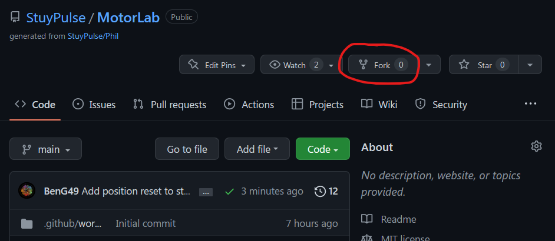
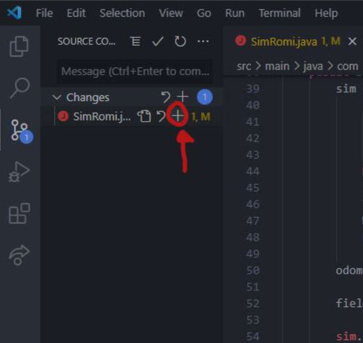
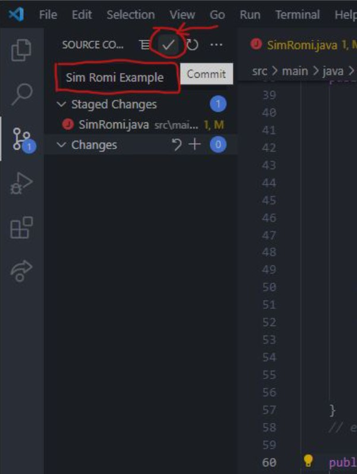
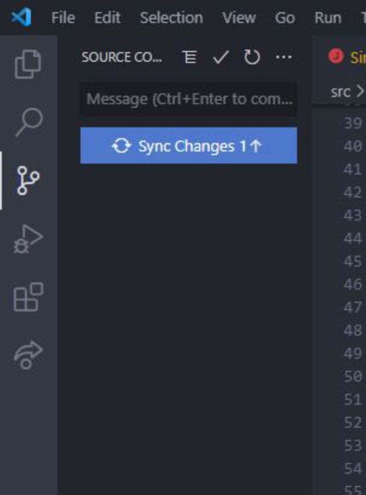
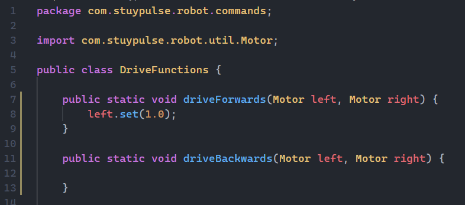
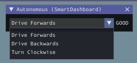
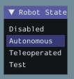

# MotorLab

## Installation

### Github
Make sure you're signed in on https://github.com/ before you start. To make a fork of this code so that you can edit and keep your own version, click on the "fork" button at the top right (shown below). Leave all of the settings as is and press "fork" again.

To download your code go back to https://github.com/ and find the new MotorLab. Click on “Code”, then “HTTPS”, and then copy the link.

Open Git Bash (or Terminal if you're on a Mac) and type `git clone <link here>` (in Git Bash you may need to right click and press paste).

### Push to Github

There are 3 steps to pushing to Github: Adding, Committing, and Pushing.

#### Adding

Before pushing code to github, you have to choose which changes you want to include. VSCode has a git menu, as shown in the picture below. If you want to add the changes from a certain file, you can hover over the file name and click "+". This will bring the changes into the "Staged Changes" section.

#### Committing

Commits are a way of grouping changes that you're going to push to github. You can add a message to your commit in the text box above "Staged Changes". To commit, click the check mark.

#### Pushing

Once you've committed, all thats left is to sync your local changes with the code online. To do this, press the blue "Sync Changes" button or click on the three dots by "Source Control" and click "Push".

### Coding
Once you've cloned your code, open the MotorLab folder in VSCode. The only file you'll be editing is [DriveFunctions.java](src/main/java/com/stuypulse/robot/commands/DriveFunctions.java) (`src/main/java/com/stuypulse/robot/commands/DriveFunctions.java`).

This is what the file should look like (some lines cut). You'll be coding in each section enclosed by `{}`, and depending on which command you run this code will be run continuously in a loop.

For example, the code below will run the left motor at 100% forever when the `Drive Forwards` command is run.

### Running your code
You can run any of your functions whenever you want to test them in a simulated environment (as long as you aren't on a Mac 😢).

To run your code, press Ctrl+Shift+P or click on the WPILib logo at the top right.

Then select `WPILib: Simulate Robot Code on Desktop`

Hit `OK` and the program should start running.
To select which command to run, use the Autonomous drop down shown below and choose your command.

To run the robot, click on "Autonomous" in the robot state selector. To restart, press "Disabled" and then "Autonomous" again.

## MotorLab

Motors are the cause of **any** movement that happens on the robot, so understanding how to interact with them in code is extremely fundamental for programming all parts of the robot. 

In general, motors are devices that convert electrical energy into motion, which is a complicated way of saying that they spin when you power them. As a result, the most common way to get a motor to do something is to give it what's called a "duty cycle", which is a value between -1.0 and +1.0 which dictates at what percent of full power the motor will spin at. 

These facts about motors are reflected in the code that is used to control them. The most common way motors are controlled in code is by setting their duty cycle value, usually by something that looks like `motor.set(1.0)`. 

For a robot's drivetrain, motors allow it to move, whether that be through human input or autonomous routines. This lab will guide you through a series of challenges to get used to utilizing motors for simple drivetrain motion, as well as building the foundation for using **control theory** to use motors for autonomous control.

### Motor Functions
<table>
    <thead>
        <tr>
            <th>Function</th>
            <th>Description</th>
            <th>Returns</th>
        </tr>
    </thead>
    <tbody>
        <tr>
            <td>left.set(x)</td>
            <td rowspan=2>Set the motor percentage to x, a value from 1.0 to -1.0 (1.0 is full speed forwards, -1.0 is full speed backwards).</td>
            <td rowspan=2>nothing (void)</td>
        </tr>
        <tr>
            <td>right.set(x)</td>
        </tr>
        <tr>
            <td>left.getDistance()</td>
            <td rowspan=2>Returns the distance in inches the motor has traveled. NOTE: if the robot moves 3 inches forward and 3 backwards, the distance will be 0.</td>
            <td rowspan=2>double</td>
        </tr>
        <tr>
            <td>right.getDistance()</td>
        </tr>
    </tbody>
</table>

## Challenges:

Using the **Motor Functions** given above, and all the Java knowledge learned (data types, variables, operators, if's and conditionals), complete these challenges within the brackets for a given function. They can be found in the [DriveFunctions.java](src/main/java/com/stuypulse/robot/commands/DriveFunctions.java) file. 

Each of these functions will run continuously, so you do **NOT** need loops to run these functions. That is handled for you.

### Driving
Simply get your romi to drive straight! No need to stop it.

Use `void driveForwards(Motor left, Motor right) {}`.

Just like the last command, but backwards:

Use `void driveBackwards(Motor left, Motor right) {}`.

### Turning
Make your romi turn in-place clockwise (to the right). It should spin around its center.

You'll need to think about this one!

Use `void turnRight(Motor left, Motor right) {}`.

Do it again but counter-clockwise (to the left):

Use `void turnLeft(Motor left, Motor right) {}`.

LOOK AT ME
LOOK AT ME
LOOK AT ME
LOOK AT ME
LOOK AT ME

\* some intermediate activities about running the motors not at just -1 and +1 to make sure they do it *

LOOK AT ME
LOOK AT ME
LOOK AT ME
LOOK AT ME
LOOK AT ME

### Basic Autonomy
Until this point, the robot has just run infinitely based on what you have hard coded. Even if you replaced the 1's and -1's with inputs from a gamepad, the robot still relies on human instruction. 

Let's start exploring autonomous robot movement, which should rely as minimally as possible on human input. One of the most essential types of autonomous movement for a robot is driving to a distance.

The distance that we want the robot to stop at is called the *setpoint*. Create a variable inside the function that represents the setpoint, and set it to `60.0`. (It can really be anything, but that's why you made it into a variable -- 60 is a good distance though). 

Use `void stopDistance(Motor left, Motor right) {}`.

What you have created is considered a *control law*, or some mathematical formula or logic that will make a *measurement* approach a *setpoint*. (Think: the measurement in this case is the distance of the robot). By telling the motors to drive forward when the setpoint has not been reached, we are increasing the measurement until it approaches a setpoint.

A good *control law* is essential for good autonomous control. This is a very simple control law, and the next few challenges will have you build on it to make better intelligent robots.

### Bang Bang
There are several issues with our first control law. Firstly, if our robot is really heavy and we let it get to a high speed, it will have built up a lot of momentum. By the time we tell it to stop, it will simply roll past the *setpoint*. 

(Think about if you were running full speed and suddenly planted your foot into the ground and stopped running. You would either topple over or hurt your leg. The robot will feel these same forces and topple over or damage itself).

A related issue is that the control law does not handle if the robot is in front of its setpoint, rather than behind. If the robot rolls over its setpoint or the setpoint was simply behind the robot, then it will tell the robot to not move. 

What we can do is write a more advanced control law that will send the robot backwards if its past its setpoint and forward if its behind its setpoint.

Use `void bangBang(Motor left, Motor right) {}`.

This control law is called Bang-Bang and its issues will make it clear how to improve even more.

### Less Bang
Bang Bang will *technically* work, but clearly when you run it, it continually oscillates. It also the same issue as our first law, where make sudden changes in direction are inconsistent and dangerous.

By changing how fast the control law will control the robot, we can get a safer and better *control loop* (control loop just refers to the code that uses a control law on a motor).

Rather than running the motors at +1.0 and -1.0, run them at a smaller value. If the value is too low, you will get a slow response time, but your oscillations will be lesser. If the value is high (e.g. 1.0) it will reach the setpoint really quickly but oscillate a lot.

For this Bang Bang version, tune the value you are feeding your motor to find a good balance of response time and oscillation.

Use `void lessBang(Motor left, Motor right) {}`

### Proportional Control
A big problem with Bang Bang (even when tuned) is that it's always running at a constant speed. 

Ideally want to avoid running at full speed when near the target, but DO want to go full speed when far from the target. Rather than a constant speed, we want the percentage we are giving to the motor to be proportional to *error*, which is the difference between the *setpoint* and the *measurement* (error = setpoint - measurement). 

If we want to code a control law in which speed to the motor is proportional to error, we will need a couple of variables: *setpoint* (set this to any number, e.g. `60.0`), *measurement* (find the average of the left and right motors' distances), and *error* (use the formula above to calculate error).

The last variable we will need is the value that we are going to multiply error by (this is what being proportional to error means -- being a multiple of it). Create a variable for this number called *kP* (set it to `1` for now). 

Lastly, calculate the value to feed to the motors using *kP* and *error* and set the motors to that value.

At this point, you can run your code, but it will basically be a bang bang loop. This is because the value you pass to `.set` is clamped between -1 and +1, so when the error is above `1.0` (because *kP* is `1` for now) the motors are going to be full speed. It is only when you're within an inch does the robot start to slow down, but by then it is too late.

So then what *DO* we set *kP* to get a good response? The unfortunate answer is that you need to tune it to get a good value, but you can make good initial guesses. 

Start by figuring out a value for *kP* that will ensure that when the autonomous routine starts it will give the motors `1.0` exactly and will decrease down to zero. Once you find this value, scale it up or down as needed to find a good balance between response time and oscillations.

Use `void betterControl(Motor left, Motor right) {}`.

This control algorithm is called a P-Control, which is one component of a greater algorithm called PID-Control.

### Derivative control

Use `void bestestControl(Motor left, Motor right) {}`.