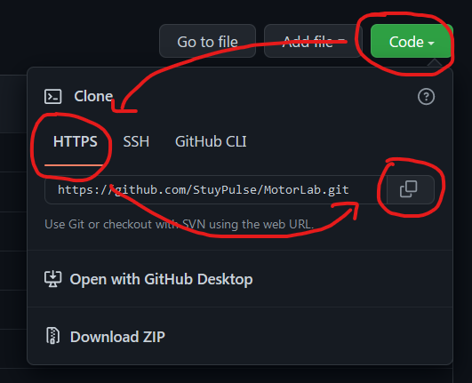
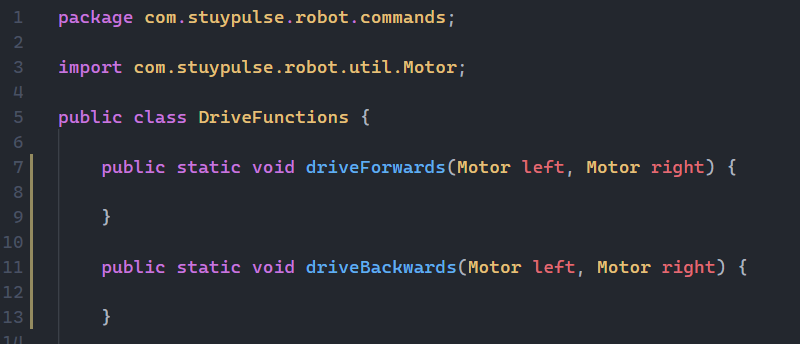

# MotorLab

## Background

Motors are the cause of **any** movement that happens on the robot, so understanding how to interact with them in code is extremely fundamental for programming all parts of the robot. 

In general, motors are devices that convert electrical energy into motion, which is a complicated way of saying that they spin when you power them. This is reflected in robot code, as the most common way to get a motor to do something is to give it what's called a "duty cycle", which is a value between -1.0 and +1.0 which dictates at what percent of full power the motor will spin at. 

This fact about motors is reflected in the code that is used to control them. The most common way motors are controlled in code is by setting their duty cycle value, usually by something that looks like `motor.set(1.0)`. 

For a robot's drivetrain, motors allow it to move, whether that be through human input or autonomous routines. This lab will guide you through a series of challenges to get used to utilizing motors for simple drivetrain motion, as well as building the foundation for using **control theory** to use motors for autonomous control.

## Guide

### Github
Make sure you're signed in on https://github.com/ before you start. To make a fork of this code so that you can edit and keep your own version, click on the "fork" button at the top right (shown below). Leave all of the settings as is and press "fork" again.

To download your code go back to https://github.com/ and find the new MotorLab. Click on “Code”, then “HTTPS”, and then copy the link.

Open Git Bash (or Terminal if you're on a Mac) and type `git clone <link here>` (in Git Bash you may need to right click and press paste).

### Push to Github

*you got this ben*

### Coding
Once you've cloned your code, open the MotorLab folder in VSCode. The only file you'll be editing is [DriveFunctions.java](src/main/java/com/stuypulse/robot/commands/DriveFunctions.java) (`src/main/java/com/stuypulse/robot/commands/DriveFunctions.java`).

This is what the file should look like (some lines cut). You'll be coding in each section enclosed by `{}`, and depending on which command you run this code will be run continuously in a loop.

For example, the code below will run the left motor at 100% forever when the `Drive Forwards` command is run.

### Running your code
You can run any of your functions whenever you want to test them in a simulated environment (as long as you aren't on a Mac 😢).

To run your code, press Ctrl+Shift+P or click on the WPILib logo at the top right.

Then select `WPILib: Simulate Robot Code on Desktop`

Hit `OK` and the program should start running.
To select which command to run, use the Autonomous drop down shown below and choose your command.

To run the robot, click on "Autonomous" in the robot state selector. To restart, press "Disabled" and then "Autonomous" again.

### Motor Functions
<table>
    <thead>
        <tr>
            <th>Function</th>
            <th>Description</th>
            <th>Returns</th>
        </tr>
    </thead>
    <tbody>
        <tr>
            <td>left.set(x)</td>
            <td rowspan=2>Set the motor percentage to <pre>x</pre>, a value from 1.0 to -1.0 (1.0 is full speed forwards, -1.0 is full speed backwards).</td>
            <td rowspan=2>nothing (void)</td>
        </tr>
        <tr>
            <td>right.set(x)</td>
        </tr>
        <tr>
            <td>left.getDistance()</td>
            <td rowspan=2>Returns the distance in inches the motor has traveled. NOTE: if the robot moves 3 inches forward and 3 backwards, the distance will be 0.</td>
            <td rowspan=2>double</td>
        </tr>
        <tr>
            <td>right.getDistance()</td>
        </tr>
    </tbody>
</table>

## Challenges:

Using the **Motor Functions** given above, and all the Java knowledge learned (data types, variables, operators, if's and conditionals), complete these challenges within the brackets for a given function. They can be found in the [DriveFunctions.java](src/main/java/com/stuypulse/robot/commands/DriveFunctions.java) file. 

### Driving
Simply get your romi to drive straight! No need to stop it.

Use `void driveForwards(Motor left, Motor right) {}`.

Just like the last command, but backwards.

Use `void driveBackwards(Motor left, Motor right) {}`.

### Turning
Make your romi turn in-place clockwise (to the right). It should spin around its center.

You'll need to think about this one!

Use `void turnRight(Motor left, Motor right) {}`.

Do it again but counter-clockwise (to the left).

Use `void turnLeft(Motor left, Motor right) {}`.

\* some intermediate activities about running the motors not at just -1 and +1 to make sure they do it *

### Basic Autonomy
Until this point, all of our commands have run without end, probably with some bad consequences. Let's make our romi stop after travelling 2 feet forwards.

Use `void stopDistance(Motor left, Motor right) {}`.

### 7: Bang bang
Although our romi does stop, you might have noticed that it overshoots our target a little bit. Lets say that we really need our romi to be on target. How about we make the romi move back if it overshot and forward if it undershoots?

Use `void bangBang(Motor left, Motor right) {}`.

### 8: Better control
We saw in the last command that, although Bang-bang does bring the romi back to the target, it also has a lot of oscillation. How can we try and fix this? Can we make the romi's speed depend on how far it is from the target?

Use `void betterControl(Motor left, Motor right) {}`.
